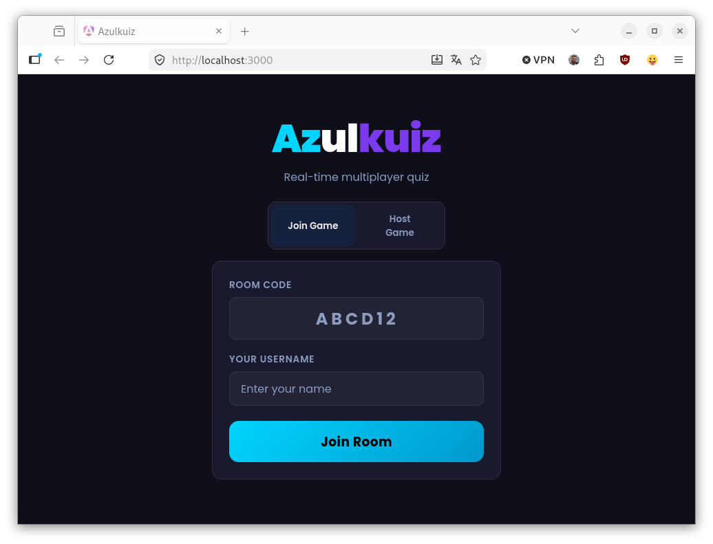

# Azulkuiz

Real-time multiplayer quiz game for live sessions. An admin creates a room, players join with a room code and pick a username, then answer free-text questions against a countdown timer. After all questions are done, the admin reviews every answer and marks them valid or invalid — players watch scores update live. Final leaderboard is shown to everyone.

## Features

- **Room-based**: admin creates a room and shares the 6-character code
- **Free-text answers**: no multiple choice — players type anything
- **Speed scoring**: faster correct answers score higher (200–1000 points per question)
- **Manual pacing**: admin advances questions at their own rhythm; timer only locks answers
- **End-of-game review**: admin marks all answers after all questions complete; scores update live for everyone
- **Reconnect support**: players who reload can rejoin with the same username and catch up to the current state
- **Image questions**: questions can show a full-width image, text, or both



---

## Running locally

### Prerequisites

- Node.js v22+
- Angular CLI v20+ (`npm install -g @angular/cli`)

### Development (with hot reload)

```bash
# 1. Install server dependencies
cd /path/to/azulkuiz
npm install

# 2. Install Angular dependencies and start dev server (proxies /api, /ws, /images to :3000)
cd client
npm install
ng serve

# 3. In a separate terminal, start the backend
cd /path/to/azulkuiz
npm run dev   # uses node --watch for auto-restart
```

Open [http://localhost:4200](http://localhost:4200). Open multiple tabs to simulate players.

### Production (pre-built)

```bash
# Build the Angular app
cd client && npm run build && cd ..

# Start the server (serves Angular dist + API + WebSocket on port 3000)
npm start
```

Open [http://localhost:3000](http://localhost:3000).

---

## Questions configuration

Questions are loaded from `questions.json` at startup:

```json
{
  "defaultTimeLimit": 20,
  "questions": [
    { "text": "What is the capital of France?", "image": null },
    { "text": null, "image": "eiffel-tower.png" },
    { "text": "Name this landmark", "image": "big-ben.png", "timeLimit": 30 }
  ]
}
```

- `text` and `image` are both optional but at least one must be set
- `timeLimit` per question overrides `defaultTimeLimit` (in seconds)
- Images go in `public/images/` and are referenced by filename only

---

## Docker

### Build image

```bash
docker build -t azulkuiz .
```

### Run with Docker Compose

```yaml
services:
  azulkuiz:
    image: azulkuiz:latest
    container_name: azulkuiz
    environment:
      UID: 1000
      GID: 1000
    volumes:
      - /path/to/questions.json:/app/questions.json:ro
      - /path/to/images:/app/public/images:ro
    restart: unless-stopped
```

Before first run, ensure the volume paths exist on the host:

```bash
mkdir -p /path/to/images
cp questions.json /path/to/questions.json
# copy your image files into /path/to/images/
```

### Behind Nginx (reverse proxy)

See `nginx.conf.example` for a working Nginx configuration. Key requirements:

- WebSocket upgrade headers on `/ws`
- `try_files $uri $uri/ /index.html` for SPA routing
- `/images/` proxied or aliased to the images directory

---

## Game flow

```
WAITING → QUESTION → LOCKED → QUESTION → LOCKED → ... → REVIEW → LEADERBOARD
```

| Phase | Who acts | What happens |
|---|---|---|
| WAITING | Admin | Share room code; players join lobby |
| QUESTION | Players | Timer counts down; players type and submit answers |
| LOCKED | Admin | Timer expired, answers frozen; admin clicks Next |
| REVIEW | Admin | Reviews all answers across all questions; marks valid/invalid |
| LEADERBOARD | Everyone | Final ranked scores displayed |

The review phase happens **once at the end**, covering all questions simultaneously.
